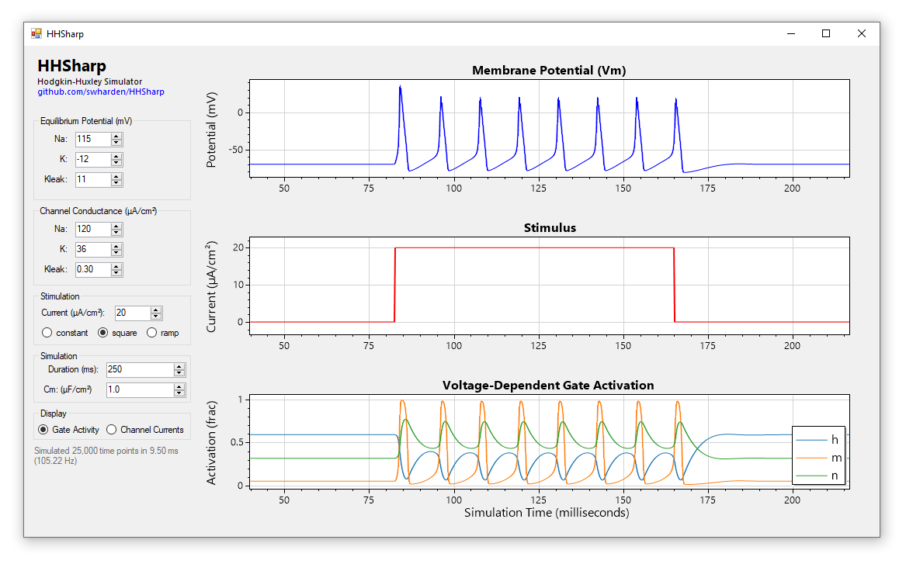

# HHSharp
**HHSharp is an interactive Hodgkin-Huxley neuron simulator written in C#.** Analytical routines were designed to be easy to understand, so this program can be used as a learning tool for anyone interested in learning more about Hodgkin-Huxley simulations. [pyHH](https://github.com/swharden/pyHH) is a similar project for Python.

HHSharp uses a simulation model which calculates channel conductances and membrane potential at discrete time points eliminating the need for a differential equation solver. The core model simulation code ([HHModel.cs](src/HHSharp/HHModel.cs)) was written to be easy to understand and is less than 100 lines of code. [ScottPlot](https://github.com/swharden/ScottPlot) is used interactively display simulation data.

## Download
* Click-to-run EXEs can be downloaded from: **[/download/](/download/)**
* Source code is available in: **[/src/](/download/)**

## Theory

### Hodgkin–Huxley model
The Hodgkin–Huxley model, or conductance-based model, is a mathematical model that describes how action potentials in neurons are initiated and propagated. 

Hodgkin–Huxley type models represent the biophysical characteristic of cell membranes. The lipid bilayer is represented as a capacitance (`Cm`). Voltage-gated and leak ion channels are represented by nonlinear (`gn`) and linear (`gL`) conductances, respectively. 

The electrochemical gradients driving the flow of ions are represented by batteries (`E`), and ion pumps and exchangers are represented by current sources (`Ip`).

### Additional Resources
* [Hodgkin and Huxley, 1952](https://www.ncbi.nlm.nih.gov/pmc/articles/PMC1392413/pdf/jphysiol01442-0106.pdf) (the original manuscript)
* [The Hodgkin-Huxley Mode](http://www.genesis-sim.org/GENESIS/iBoG/iBoGpdf/chapt4.pdf) (The GENESIS Simulator, Chapter 4)
* Wikipedia: [Hodgkin–Huxley model](https://en.wikipedia.org/wiki/Hodgkin%E2%80%93Huxley_model)
